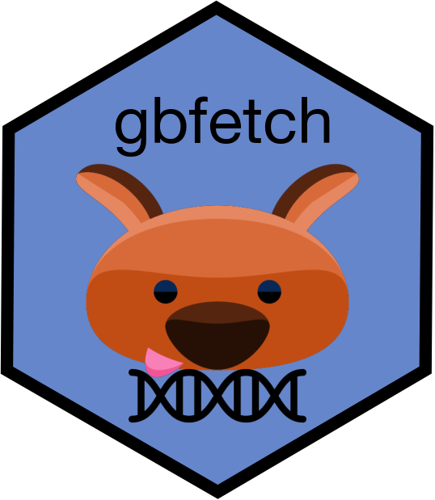

# gbfetch 

<!-- badges: start -->

[](https://travis-ci.org/joelnitta/gbfetch)
<!-- badges: end -->

`gbfetch` makes it easy to download DNA sequences from
[GenBank](https://www.ncbi.nlm.nih.gov/genbank/) directly into R.

You can provide a [query string exactly as you would for a GenBank
search](https://www.ncbi.nlm.nih.gov/nuccore/advanced), and it will
return the corresponding sequences or metadata in a tidy format.

## Installation

`gbfetch` is only available on GitHub, and must be installed with
`devtools` or `remotes`.

``` r
devtools::install_github("joelnitta/gbfetch")
```

## Dependencies

Most R packages `gbfetch` depends on will be automatically detected and
installed from [CRAN](https://cran.r-project.org/) if needed. There are
two exceptions.

`jntools` is only available on GitHub, and must be installed first.

``` r
devtools::install_github("joelnitta/jntools")
```

`biofiles` is not required to install `gbfetch`, but is a needed for
`assemble_gene_set()`, so install it if you want to use this function.
`biofiles` is only availble from
[BioConductor](https://bioconductor.org/), and itself has dependencies
that are only available from BioConductor.

``` r
BiocManager::install("biofiles")
```

## GenBank API key

The `fetch_sequences()` and `fetch_metadata()` functions in this package
use `taxize` and `rentrez` functions under the hood to fetch taxonomic
data and GenBank sequences. Although not required, enabling the [NCBI
Entrez API
key](https://ncbiinsights.ncbi.nlm.nih.gov/2017/11/02/new-api-keys-for-the-e-utilities/)
will increase the number of requests you are allowed to make per second.
This should be set up using `taxize::use_entrez()` prior to running
`fetch_` functions or your query might get rejected and no sequences
returned.

## Large downloads

This package is meant for downloading moderate amounts of data, **not**
whole swaths of GenBank. If you want to access large amounts of data,
the [restez](https://ropensci.github.io/restez/index.html) or
[biomartr](https://github.com/ropensci/biomartr) packages might be
better options.

I am not aware of an upper limit on the number of sequences that can be
downloaded, but I haven’t tried more than ca. 10,000 at a time (which
takes just a few minutes with `fetch_sequences()`). `fetch_metadata()`
takes significantly longer, because it uses `taxize` to get species
names, which is rather slow. Obtaining the metadata for ca. 10,000
sequences might take up to an hour or so.

Trying to fetch too many sequenes might result in your IP address
getting rejected by the API (at least temporarily), so use with
caution\!

## Data format

Sequence data are stored using the `DNAbin` class from the `ape`
package. If you work with BioConductor packages that use the `DNAString`
class, they will need to be converted. I’m not aware of a
`as.DNAString()` function that can do this, so [I wrote
one](https://gist.github.com/joelnitta/6f30a7c0f1c83d78c76a5469e935d56f).

## Similar work

[rentrez](https://github.com/ropensci/rentrez) (which `gbfetch` uses
under the hood) has much more sophisticated capabilities for querying
NCBI databases.

The [ape](http://ape-package.ird.fr/) package has a function,
[read.GenBank()](https://www.rdocumentation.org/packages/ape/versions/5.3/topics/read.GenBank)
that can read in a DNA sequence from GenBank given its accession number.

[restez](https://ropensci.github.io/restez/index.html) allows you to
download entire chunks of GenBank for querying locally. This is almost
certainly the way to go if you are interested in downloading lots of
data.

[biomartr](https://github.com/ropensci/biomartr) is designed for
downloading and working with whole genomes on GenBank.

[phylotaR](https://github.com/ropensci/phylotaR) queries GenBank for a
taxonomic group of interest and automatically assembles a set of
orthologous loci for phylogenetic analysis.

[PyPHLAWD](https://github.com/FePhyFoFum/PyPHLAWD) is a Python pipeline
for assembling a set of loci for phylogenetic analysis.

## Examples

(See notes above about setting your API key before running these)

### Fetch sequences and metadata

Download all *rbcL* sequences for *Crepidomanes minutum*. The query
string is formatted [exactly as if we were searching on
GenBank](https://www.ncbi.nlm.nih.gov/nuccore/advanced).

Though you don’t need to do this in practice, I will use `tictoc` to
give an idea of how long this query takes.

``` r
library(gbfetch)
library(tictoc) # Optional; for timing the example

query_string <- "Crepidomanes minutum[ORGN] AND rbcl[Gene]"

tic() # Set a timer

fetch_sequences(query_string)
```

    ## 99 DNA sequences in binary format stored in a list.
    ## 
    ## Mean sequence length: 1191.525 
    ##    Shortest sequence: 358 
    ##     Longest sequence: 1309 
    ## 
    ## Labels:
    ## KY099784
    ## EU338465
    ## EU122974
    ## EU122973
    ## EU122972
    ## AB574710
    ## ...
    ## 
    ## Base composition:
    ##     a     c     g     t 
    ## 0.272 0.191 0.243 0.294 
    ## (Total: 117.96 kb)

``` r
toc() # See how long it took
```

    ## 2.193 sec elapsed

Download associated metadata for the sequences.

``` r
tic() # Set a timer

fetch_metadata(query_string)
```

    ## Registered S3 method overwritten by 'crul':
    ##   method                 from
    ##   as.character.form_file httr

    ## # A tibble: 99 x 8
    ##         gi accession taxid title       slen subtype     subname     species
    ##      <int> <chr>     <int> <chr>      <int> <chr>       <chr>       <chr>  
    ##  1  1.28e9 KY099784  32127 Crepidoma…  1309 isolate|sp… JNG0671|Ni… Crepid…
    ##  2  1.70e8 EU338465  32127 Crepidoma…  1238 specimen_v… J.Nitta041… Crepid…
    ##  3  1.62e8 EU122974  32127 Crepidoma…  1238 specimen_v… J.Nitta076… Crepid…
    ##  4  1.62e8 EU122973  32127 Crepidoma…  1238 specimen_v… J.Nitta028… Crepid…
    ##  5  1.62e8 EU122972  32127 Crepidoma…  1238 specimen_v… J.Nitta008… Crepid…
    ##  6  3.13e8 AB574710  32127 Crepidoma…  1205 specimen_v… TNS:762567… Crepid…
    ##  7  5.46e8 AB479140  32127 Crepidoma…  1206 specimen_v… personal:T… Crepid…
    ##  8  5.46e8 AB479139  32127 Crepidoma…  1206 specimen_v… personal:S… Crepid…
    ##  9  5.46e8 AB479138  32127 Crepidoma…  1206 specimen_v… personal:A… Crepid…
    ## 10  5.46e8 AB479137  32127 Crepidoma…  1206 specimen_v… personal:S… Crepid…
    ## # … with 89 more rows

``` r
toc()
```

    ## 25.967 sec elapsed

### Assemble a set of genes from genomes

The number of whole or partial genomes in GenBank is increasing rapidly.
Although `fetch_sequnces()` is useful for downloading small (e.g.,
single gene) sequences, we may also want to download multiple genes from
a single genome or genomes. That is where `fetch_gene_from_genome()`
comes in.

Let’s download three genes of interest from the *Diplazium striatum*
plastome, which has [GenBank accession number
KY427346](https://www.ncbi.nlm.nih.gov/nuccore/KY427346).

``` r
# KY427346 is the GenBank accession no. for the Diplazium striatum plastome

tic() # Set a timer

genes_to_get <- c("rbcL", "matK", "psbA")
fetch_gene_from_genome(genes_to_get, "KY427346")
```

    ## $rbcL
    ## 1 DNA sequence in binary format stored in a list.
    ## 
    ## Sequence length: 1428 
    ## 
    ## Label:
    ## KY427346-rbcL
    ## 
    ## Base composition:
    ##     a     c     g     t 
    ## 0.271 0.230 0.251 0.248 
    ## (Total: 1.43 kb)
    ## 
    ## $matK
    ## 1 DNA sequence in binary format stored in a list.
    ## 
    ## Sequence length: 1503 
    ## 
    ## Label:
    ## KY427346-matK
    ## 
    ## Base composition:
    ##     a     c     g     t 
    ## 0.310 0.187 0.192 0.311 
    ## (Total: 1.5 kb)
    ## 
    ## $psbA
    ## [1] "Multiple genes detected"

``` r
toc()
```

    ## 7.626 sec elapsed

Scaling up, `assemble_gene_set()` can assemble multiple genes of
interest from multiple genomes into a list. Let’s get the same three
genes for *Cystopteris protrusa* (GenBank accession no. KP136830) and
*Diplazium
striatum*.

``` r
# KY427346 is the GenBank accession no. for the Diplazium striatum plastome

tic() # Set a timer

assemble_gene_set(
  accessions = c("KP136830", "KY427346"), 
  genes = genes_to_get)
```

    ## [1] "These genes were duplicated within at least one accession and dropped: psbA"

    ## $rbcL
    ## 2 DNA sequences in binary format stored in a list.
    ## 
    ## All sequences of same length: 1428 
    ## 
    ## Labels:
    ## KP136830-rbcL
    ## KY427346-rbcL
    ## 
    ## Base composition:
    ##     a     c     g     t 
    ## 0.270 0.227 0.252 0.251 
    ## (Total: 2.86 kb)
    ## 
    ## $matK
    ## 2 DNA sequences in binary format stored in a list.
    ## 
    ## Mean sequence length: 1626 
    ##    Shortest sequence: 1503 
    ##     Longest sequence: 1749 
    ## 
    ## Labels:
    ## KP136830-matK
    ## KY427346-matK
    ## 
    ## Base composition:
    ##     a     c     g     t 
    ## 0.310 0.183 0.194 0.313 
    ## (Total: 3.25 kb)

``` r
toc()
```

    ## 6.044 sec elapsed
